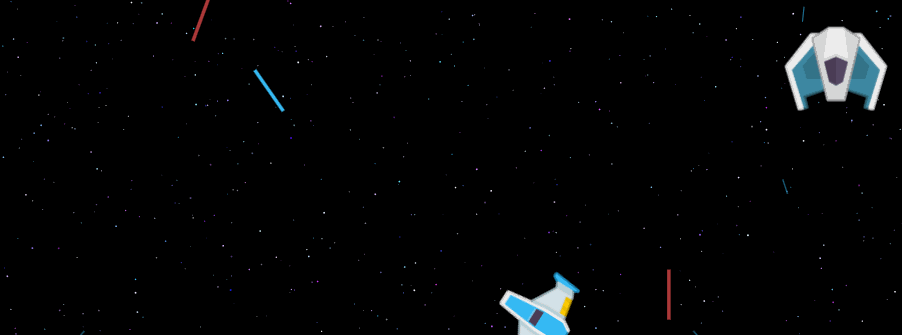

# Galactic Chaos



A spaceship shooter game. 

[Play here.](https://galactic-chaos.ghpages.io/)

# Getting started

```bash
# requires node (v18)
npm i # install dependencies
npm run dev # run the development server (vite)

# to build and preview
npm run build # build the project to `/dist` (vite)
npm run preview # run the preview server (vite)
```

# CREDITS

Image assets (CC0) by [Kenney.](https://www.kenney.nl/)

Music by me.

# LICENSE

This project is [MIT licensed](../LICENSE).

---

# About

Web game that uses (Web) APIs such as [Canvas](https://developer.mozilla.org/en-US/docs/Web/API/CanvasRenderingContext2D), [Audio](https://developer.mozilla.org/en-US/docs/Web/API/Web_Audio_API) and [Gamepad](https://developer.mozilla.org/en-US/docs/Web/API/Gamepad_API). No game engine was used.

## Structure

The entire project uses a single HTML file where the HUD and menus reside. Some CSS and SVG were set inline to avoid abrupt rendering changes, especially on the first visit (sudden background color changes, for example).

The entry point is [`src/main.ts`](../src/main.ts). It waits for the [`DOMContentLoaded` event](https://developer.mozilla.org/en-US/docs/Web/API/Window/DOMContentLoaded_event) to show the main menu.

When the player starts the game, a loop is created using [`requestAnimationFrame()`](https://developer.mozilla.org/en-US/docs/Web/API/window/requestAnimationFrame).

Inside the game [loop](../src/main/loop.ts), a [GameManager](../src/main/GameManager.ts) is instantiated. It's a wrapper class that setups and manages input, canvas, pause state, and the LevelManager. It is also where the "on-screen-debug" ([more details](#debug)) feature is configured.

Next, the [LevelManager](../src/level/LevelManager.ts) handles level loading, game state, and game objects.

A `Level` is simply an async function that returns an array of [GameObjects](../src/objects/shared/GameObject.ts).

## Input

The game supports keyboard/mouse and [gamepad](https://developer.mozilla.org/en-US/docs/Web/API/Gamepad_API/Using_the_Gamepad_API). A common interface ([InputHandler](../src/common/controls/Input.ts)) was created to consolidate the behavior, regardless of its source.

Menus support both input sources at the same time. The player can **swap** between input sources while on `pause menu`. If the player is using keyboard/mouse, connects a gamepad, and press Start to resume, the game will now respond to the gamepad (and vice versa). 

Most menu functions are debounced to avoid triggering the same action multiple times.

## Audio

The [WebAudio API](https://developer.mozilla.org/en-US/docs/Web/API/Web_Audio_API) was used to play the background music. Due to most browsers having [autoplay policies](https://developer.chrome.com/blog/autoplay/#webaudio), the user is required to enable the audio using the menu.

## Movement

Movement might have been the most challenging feature to implement.

Even though helper/syntactic sugar-ish code was implemented ([FluentMovement](../src/objects/shared/movement/FluentMovement.ts)), designing movement patterns for enemies relied heavily on mental abstraction. The implementation of a preview GUI is strongly considered in the future.

### Lerp

> Note: Even though it is a "universally" known concept, I found it important to address it.

Lerp stands for linear interpolation.

```ts
function lerp(a: number, b: number, t: number) {
  return (1 - t) * a + t * b;
}
```

What I failed to understand at first:

> `t` should change, `a` and `b` should not.

Considerations:

- (Usually) The "progress" (`t`) changes over time.
- Since it's an `inter`polation, the `t` value ranges from 0 to 1 (0 is `a`, 1 is `b`).
- There's also something called `extra`polation, where `t` can be lower than 0 or higher than 1 (that way values can be projected before `a` - below 0 - and after `b` - above 1).
- You can "shape" the "progress" (`t`) using a "shaping function." [See examples.](https://easings.net/)

Usage A: In a scenario where an object's transparency needs to be progressively changed, lerp can be used to fade in and out of these states (opaque <> transparent).

Usage B: When an object needs to move from point `a` to point `b` in a straight line, the lerp function can calculate the intermediate steps between these two points.

```ts
interface Point {
  x: number;
  y: number;
}

function pointLerp(a: Point, b: Point, t: number): Point {
  return {
    x: lerp(a.x, b.x, t),
    y: lerp(a.y, b.y, t),
  };
}
```

### Bezier

Lerp, on its own, takes care of linear movement (lines/rects). To achieve different movement patterns for the game mobs, quadratic and cubic bezier were introduced.

[There's an extensive video on the topic by Freya Holmér](https://youtu.be/aVwxzDHniEw).

## Debug

An "on-screen-debug" feature was implemented. There are options to show hitboxes, angles, positions, and trajectories (+filtering by game object/entity type).


---

# Known Issues

- Screen resize: affects both overall dimensions and movement
  - Movement is instantiated once per object. If the world boundaries, frame time (monitor frequency) or object dimensions change, moving objects will not behave as expected.
  - Dimensions are set once per object. If the world boundaries change, rendered objects won't resize.
- Gamepad disconnected (the game stops responding)
- Not supported
  - Smartphones/tablets/smaller devices
  - Browsers that do not support JS modules (most browsers, as of the publishing of this project, support this feature)
