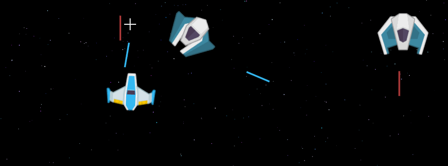

# Galactic Chaos



A spaceship shooter game. 

[Play here.](https://galactic-chaos.netlify.app)

# Getting started

```bash
# requires node (>=18)
npm i # install dependencies
npm run dev # run the development server (vite)

# to build and preview
npm run build # build the project to `/dist` (vite)
npm run preview # run the preview server (vite)
```

# CREDITS

[Image assets](https://www.kenney.nl/assets/space-shooter-redux) ([CC0](https://creativecommons.org/share-your-work/public-domain/cc0/)) by [Kenney.](https://www.kenney.nl/)

[Orbitron](https://fonts.google.com/specimen/Orbitron/about) Font ([OFL](https://scripts.sil.org/cms/scripts/page.php?site_id=nrsi&id=OFL)) by [Matt McInerney](https://matt.cc/).

Music by me.

# LICENSE

This project is [MIT licensed](../LICENSE).

---

# About

Web game that uses APIs such as [Canvas](https://developer.mozilla.org/en-US/docs/Web/API/CanvasRenderingContext2D), [Audio](https://developer.mozilla.org/en-US/docs/Web/API/Web_Audio_API) and [Gamepad](https://developer.mozilla.org/en-US/docs/Web/API/Gamepad_API). No game engine was used.

## Game Structure

The entry point is [`main.ts`](../src/game/main.ts). When the player starts the game, a loop is created using [`requestAnimationFrame()`](https://developer.mozilla.org/en-US/docs/Web/API/window/requestAnimationFrame).

Inside the game [loop](../src/game/loop.ts), a [GameManager](../src/game/GameManager.ts) is instantiated. It's a wrapper class that setups and manages input, canvas, pause state, and levels. It is also where the ["on screen debug"](#debug) is configured. 

Next, the [LevelManager](../src/game/level/LevelManager.ts) handles level loading, game state, and game objects.

A `Level` is simply an async function that returns an array of [GameObjects](../src/core/objects/shared/GameObject.ts).

HTML contents for the game can be [found here](../index.html).

## Input

The game supports input from both keyboard/mouse and [gamepad](https://developer.mozilla.org/en-US/docs/Web/API/Gamepad_API/Using_the_Gamepad_API). To consolidate the behavior regardless of the input source, a [common interface (InputHandler)](../src/core/controls/Input.ts) was created.

The menus support simultaneous input from both keyboard/mouse and gamepad sources. While on the pause menu, the player can **swap** between input sources. For example, if the player is using keyboard/mouse and connects a gamepad, they can press the Start button to resume the game, and from that point on, the game will respond to the gamepad input (and vice versa).

## Audio

The [WebAudio API](https://developer.mozilla.org/en-US/docs/Web/API/Web_Audio_API) was used to play the background music. Due to most browsers having [autoplay policies](https://developer.chrome.com/blog/autoplay/#webaudio), the user is required to enable the audio using the menu.

## Movement

Movement might have been the most challenging feature to implement.

Even though [helper code was implemented](../src/core/objects/shared/movement/FluentMovement.ts), designing movement patterns for enemies relied heavily on mental abstraction. ~~The implementation of a preview GUI is strongly considered in the future~~. Check out the [playground](#playground).

### Lerp

> Note: Even though it is a "universally" known concept, I found it important to address it.

Lerp stands for linear interpolation.

```ts
function lerp(a: number, b: number, t: number) {
  return (1 - t) * a + t * b;
}
```

What I failed to understand at first:

> `t` should change, `a` and `b` should not.

Considerations:

- (Usually) The "progress" (`t`) changes over time.
- Since it's an `inter`polation, the `t` value ranges from 0 to 1 (0 is `a`, 1 is `b`).
- There's also something called `extra`polation, where `t` can be lower than 0 or higher than 1 (that way values can be projected before `a` - below 0 - and after `b` - above 1).
- You can "shape" the "progress" (`t`) using a ["shaping function."](https://easings.net/)

Usage A: In a scenario where an object's transparency needs to be progressively changed, lerp can be used to fade in and out of these states (opaque <> transparent).

Usage B: When an object needs to move from point `a` to point `b` in a straight line, the lerp function can calculate the intermediate steps between these two points.

```ts
interface Point {
  x: number;
  y: number;
}

function pointLerp(a: Point, b: Point, t: number): Point {
  return {
    x: lerp(a.x, b.x, t),
    y: lerp(a.y, b.y, t),
  };
}
```

### Bezier

Lerp, on its own, takes care of linear movement (lines/rects). To achieve different movement patterns for the game mobs, quadratic and cubic bezier were introduced.

[There's an extensive video on the topic by Freya Holmér](https://youtu.be/aVwxzDHniEw).

## Debug

An "on-screen-debug" feature was implemented. There are options to show hitboxes, angles, positions, and trajectories (+filtering by game object/entity type).


## Playground

To get a glimpse of how things work behind the scenes, [you can visit the playground here](https://galactic-chaos.netlify.app/playground).


---

# Known Issues

- Screen resize: affects both overall dimensions and movement
  - Movement is instantiated once per object. If the world boundaries, frame time (monitor frequency) or object dimensions change, moving objects will not behave as expected.
  - Dimensions are set once per object. If the world boundaries change, rendered objects won't resize.
- Not supported (devices)
  - Smartphones/tablets/smaller devices
  - Browsers that do not support JS modules (as of the publishing of this project, [most browsers support this feature](https://caniuse.com/es6-module))
- Rarely, audio tracks can overlap each other (especially while exiting menus)